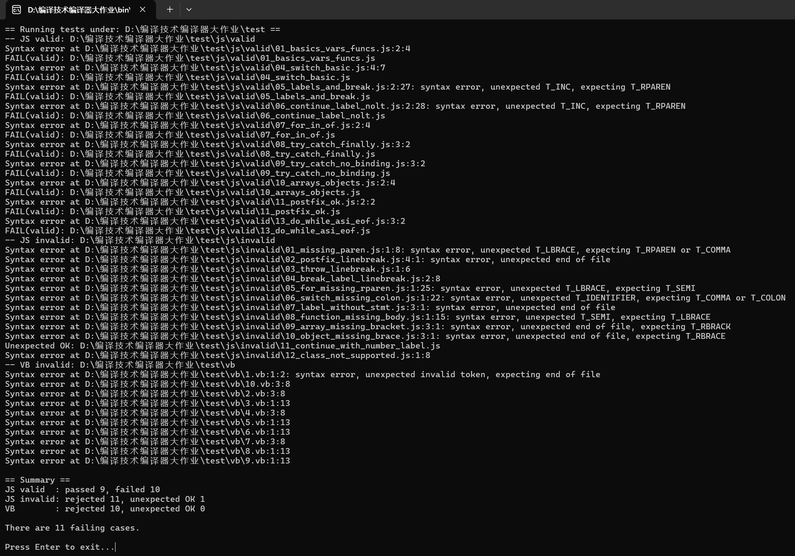

# JavaScript 语法解析器（C + re2c + bison，支持 ASI）

#### 成员：刘明昊


本解释器用于判定 JavaScript 源代码是否“语法正确”。实现了自动分号插入（ASI），并覆盖常见语法构件：块/变量/函数、if/while/do-while/for、break/continue/return/throw、try/catch/finally、switch/case/default、labelled statement、debugger、表达式语句、各种运算与成员/调用/索引、数组/对象字面量（含尾逗号）、for-in/for-of 等。

首先展示本解释器在若干测试用例（js正/反例、vb脚本）上的输出结果，后续为更细致的项目介绍。


核心组件
- 词法：re2c 生成（`src/lexer.re`），识别关键字/操作符/字面量/标识符，跟踪行列与“两个 token 之间是否出现过换行”（用于 ASI）。
- 语法：bison 生成（`src/parser.y`），当前配置为 GLR 解析器（更稳健地处理冲突）。支持 no-LineTerminator 限制（return/throw/break/continue 后禁止换行，后缀 ++/-- 前禁止换行）。
- 运行：C11（gcc）。Windows 支持 MSYS2 UCRT64；Linux/WSL 亦可。

兼容性与编码
- 输入文件支持 UTF-8（含/不含 BOM），以及 UTF-16LE/UTF-16BE；内部会统一转换。建议保存为 UTF-8 无 BOM。
- Windows 双击可执行文件（无参数）将自动运行 test 目录下内置用例并汇总结果；命令行带路径参数时则检查单个 JS 文件。

---

## 快速开始（本Git项目中实际包含了make的结果，可以make clean && make 进行本地构建）

依赖
- re2c、bison、gcc（C11）
- 可选：ripgrep（`rg`，用于 corpus 目标）

安装建议
- Windows（MSYS2 UCRT64）
  - pacman -Syu（更新多次到无可更新）
  - pacman -S mingw-w64-ucrt-x86_64-gcc make bison re2c
  - 可选：pacman -S mingw-w64-ucrt-x86_64-ripgrep


构建
- 在项目根目录执行：make
  - 生成 `src/parser.c`、`src/parser.h`、`src/lexer.c`，并链接出 `bin/jsparser`
- 清理：make clean

运行
- 单文件检查：./bin/jsparser path/to/file.js
  - 退出码 0：OK；1：语法错误（带行列与消息）；2：IO 或内部错误


双击运行（Windows）
- 双击 `bin\jsparser.exe`：自动在测试目录 `test/` 下执行用例并输出汇总，最后按回车退出。

---

## Makefile 目标与操作

- 默认：make
  - 生成 `bin/jsparser`
- 清理：make clean
- 内置测试：make test
  - 逐个检查 
  - `test/js/valid/*.js` 
  - `test/js/invalid/*.js` 
  - `test/vb/*.vb` 
- 大型数据集（可以加入）：
  - JS 语料：make corpus-js DATASET_JS=/path/to/js_dataset
    - 使用 ripgrep 递归匹配 `*.js`，逐个检查并报告语法错误文件
  - VB 语料：make corpus-vb DATASET_VB=/path/to/vb_examples
    - 所有 `*.vb` 均应被拒绝


---

## 添加/维护测试用例

内置测试目录结构
- `test/js/valid/`：正例（应“通过”）
- `test/js/invalid/`：反例（应“拒绝”）
- `test/vb/`：VB 反例（全部应“拒绝”）

新增用例步骤
1) 在对应目录添加 `.js` 或 `.vb` 文件（建议 UTF-8 无 BOM）
2) 执行 `make test`，观察输出汇总
3) 单个文件验证可用：`./bin/jsparser test/js/valid/xxx.js`

示例
- 新增一个 ASI 场景用例：`test/js/valid/21_asi_example.js`
  ```js
  a = 1
  b = 2
  a + b

使用示例

- 在构建后检查单个文件：

  `./bin/jsparser test/js/valid/01_basics_vars_funcs.js`


- 输出：OK（通过），或 `Syntax error at <file>:<line>:<col>: <message>`

- Windows 双击 bin\jsparser.exe（无参数）：自动运行内置用例并打印汇总，最后提示按回车退出

- 注意：若希望在普通 CMD/PowerShell 中运行，要先把 C:\msys64\ucrt64\bin 加入 环境变量（高级系统设置中）

---

## 目录结构（关键文件）

- src/parser.y：bison 语法文件（GLR 解析器）

- src/lexer.re：re2c 词法文件（两参 yylex）

- src/parser_driver.c：IO/编码归一化/解析入口

- src/main.c：命令行/双击入口逻辑

- include/parser_driver.h：解析入口声明

- test/js/valid|invalid：JS 正/反例

- test/vb：VB 反例

- bin/jsparser：构建产物
